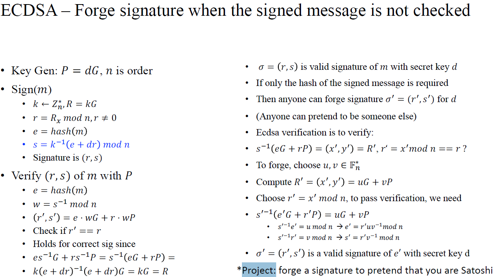
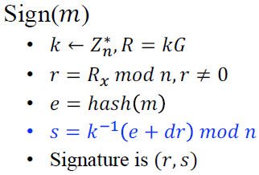
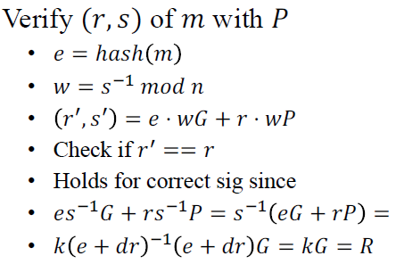
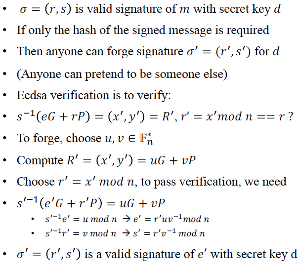
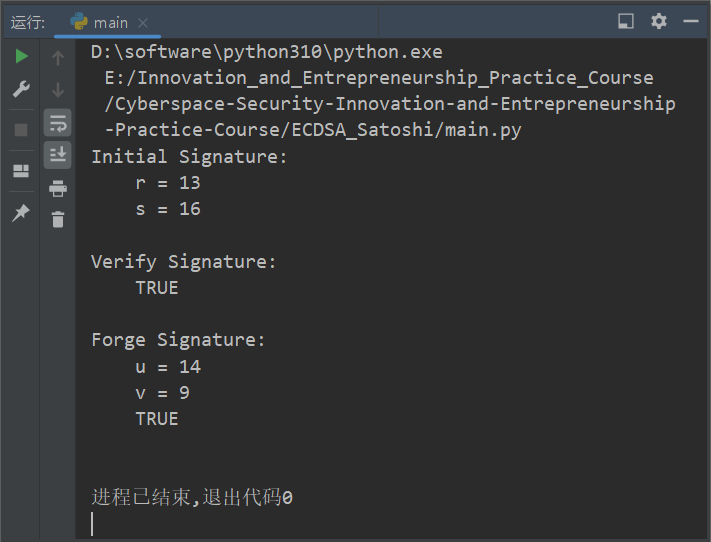

# [ECDSA_Satoshi](https://github.com/MaxIkaros/Cyberspace-Security-Innovation-and-Entrepreneurship-Practice-Course/tree/main/ECDSA_Satoshi)

## 对应题目



Forge a signature to pretend that I am Satoshi Nakamoto.

## 项目代码说明

1. 首先完成一些准备工作：

	- 使用一个简单的命名元组来表示椭圆曲线的仿射部分上的点：

		```python
		Point = namedtuple("Point", "x y")
		```

	- 用`O`表示原点：

		```python
		O = Point(0, 0)
		```

	- 定义椭圆曲线参数：

		```python
		p = 17
		a = 2
		b = 2
		G = Point(5, 1)
		n = 19
		```

	- 定义相关参数；

		```python
		m = "Satoshi"
		e = hash(m)
		d = 7
		KG_P = EccPointMul(d, G) # Key Gen: P = dG
		```

	- 定义相关数学函数：

		```python
		def gcd(aa, bb) # math.gcd(eval(aa), eval(bb))
		def IntModInverse(bb, _n, show=False) # calc : bb^(-1) mod _n
		```

	- 定义相关椭圆曲线函数：

		```python
		def isValid(P) # Determine whether we have a valid representation of a point on our curve.
		def EccInv(P) # 求点P在椭圆曲线上的对称点（关于y轴对称）
		def EccAdd(P, Q) # P + Q = ？
		def EccPointMul(k, P) # 椭圆曲线上点的数乘
		```

2. 签名函数`Sign`：

	主要实现思路：

	

	在本实验代码中`(r, s)`合成一个称为`Signature`的点return了。

3. 验证签名函数`Verify`和`Verify_without_e`：

	`Verify`函数主要实现思路：

	

	而`Verify_without_e`函数与上图的步骤相比，少了

	```python
	e = hash(m)
	```

	这一步。

4. 伪造签名函数`ForgeSign`：

	主要实现思路：

	

### 实验环境

Pycharm Community Edition 2021.2.3

## 运行指导

直接运行[main.py](main.py)文件即可，也可在Pycharm平台上运行。

- 由于求模逆的扩展欧几里得算法`IntModInverse`在不存在模逆时会返回`None`，从而导致之后的运算出现error（`int`型和`Nonetype`型参数不可相乘），因而当遇到此种情况时，请重新运行[main.py](main.py)文件即可。

## 代码运行全过程截图



其中：

- `Initial Signature`：一开始时按照正常步骤生成的`(r, s)`；
- `Verify Signature`：验证按照正常步骤生成的`(r, s)`是否正确，`True`说明签名正确，`False`说明签名不正确；
- `Forge Signature`：伪造的签名`(u, v)`及其验证的结果，`True`说明`(u, v)`通过验证，`False`说明`(u, v)`不通过验证。

## 具体贡献说明及贡献排序

全部代码及对应思路：[葛萧遥-202000460091](https://github.com/MaxIkaros)。

## 参考资料

1. 2022年5月26日上课时的课件和录屏。
2. [Python中有限域上的椭圆曲线点加法](https://qa.1r1g.com/sf/ask/2175192071/#)
