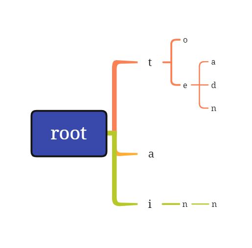
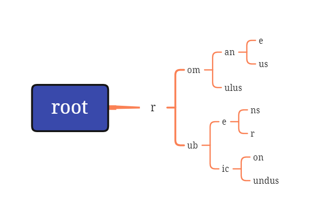
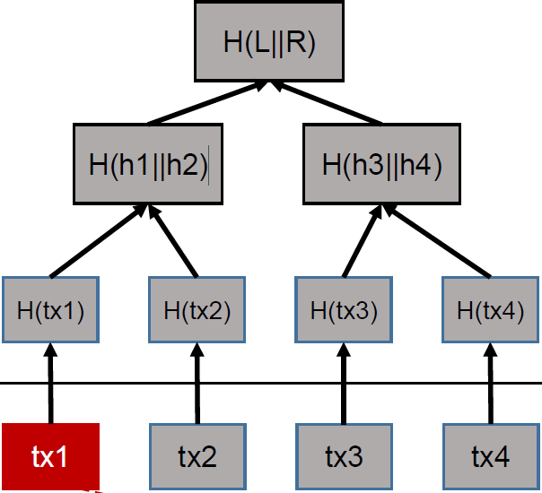
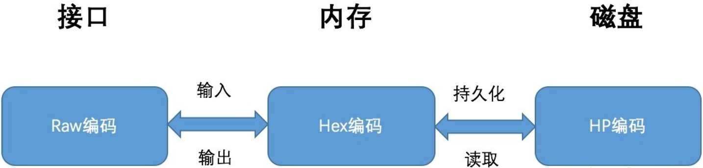

# MPT Research Report

作者：[葛萧遥-202000460091](https://github.com/MaxIkaros)

------

## 概述

Merkle Patricia Tree（又称为Merkle Patricia Trie，简称MPT树）是一种经过改良的、融合了Merkle和Radix两种树结构优点的数据结构，是以太坊中用来组织管理账户数据、生成交易集合哈希的重要数据结构。

MPT树有以下几个作用：

- 存储任意长度的key-value键值对数据，符合以太坊的state模型；
- 提供了一种快速计算所维护数据集哈希标识的机制；
- 提供了快速状态回滚的机制；
- 提供了一种称为默克尔证明的证明方法，进行轻节点的扩展，实现简单支付验证；

由于MPT结合了Radix和Merkle两种树结构的特点与优势 ，因此，在介绍MPT之前需要知道这两种树结构的特点。

## Trie/Radix树

Trie树，又称Radix树、前缀树或字典树 ，是一种有序树，用于保存关联数组，其中的键（key）通常是字符串。与二叉查找树不同的是，键不是直接保存在节点中，而是由节点在树中的位置决定。一个节点的所有子孙都有相同的前缀，也就是这个节点对应的字符串，而根节点对应空字符串。

一般情况下，不是所有的节点都有对应的值， 只有叶子节点和部分内部节点所对应的键才有相关的值。实际上，trie每个节点是一个确定长度的数组，数组中每个节点的值是一个指向子节点的指针，最后有个标志域，标识这个位置为止是否是一个完整的字符串。

### 典型的前缀树：



图中的前缀树存储了一些字符串，黑色的是关键字，存储的字符串由关键字组成。存储了"a", "to", "tea", "ted", "ten", "i", "in", "inn"。"root"为根结点，不包含字符串信息。

### 特点：

- 根节点不包含字符，其他节点各包含一个字符；

- 关键路径节点的字符连接起来为该节点所存储的数据。

	> 关键路径就是每个节点有一个标志位，用来标记这个节点是否作为构成数据的一部分，上图中的"t", "e"节点就不是关键路径。

### 核心思想：

用空间换时间，利用公共前缀来缩小要比较的范围从而达到快速查找的目的。

### 优点

- 插入和查询的效率都很高，都是O(m)，其中m是插入或查询字符串的长度；
- 可以对数据按照字典序排序。

### 缺点

- 空间的消耗会比较大：

	假如有一个很长的key，没有其他的key和它有公共的前缀，那么在遍历或存储它对应的值得时候就会遍历或存储相当多的节点，因为这棵树是非常不平衡的。

### 典型场景

- 词频次统计；
- 字符串匹配；
- 字符串字典序排序；
- 前缀匹配，比如一些搜索框的自动提示。

## Patricia树

Patricia树（或称Patricia trie、crit bit tree、压缩前缀树）是一种更节省空间的Trie。对于基数树的每个节点，如果该节点是唯一的儿子的话，就和父节点合并。

下图是一棵Patricia树：



该树存储了"romane", "romanus", "romulus", "rubens", "ruber", "rubicon", "rubicundus"，与压缩前的相比占用了更小空间。

## Merkle树

Merkle树是由计算机科学家Ralph Merkle在很多年前提出的，并以他本人的名字来命名的一种树。

Merkle Tree，通常也被称作Hash Tree，顾名思义，就是存储hash值的一棵树。

### 特点

- Merkle Tree是一种树，大多数是二叉树，也可以多叉树。无论是几叉树，它都具有树结构的所有特点；
- Merkle Tree叶子节点的value是数据项的内容，或者是数据项的哈希值；
- 非叶子节点的value根据其孩子节点的信息，然后按照Hash算法计算而得出的。

在Bitcoin网络中，Merkle树被用来归纳一个区块中的所有交易，同时生成整个交易集合的数字指纹。此外，由于Merkle树的存在，使得在Bitcoin这种公链的场景下，扩展一种“轻节点”实现简单支付验证变成可能。

### 原理



将相邻两个节点的hash值合并成一个字符串，然后计算这个字符串的hash，得到的就是这两个节点的父节点的hash值。

若该层的树节点个数是单数，那么，对于最后剩下的树节点，此时就直接对它进行hash运算，其父节点的hash就是其hash值的hash值（对于单数个叶子节点，有着不同的处理方法，也可以采用复制最后一个叶子节点凑齐偶数个叶子节点的方式）。循环重复上述计算过程，最后计算得到最后一个节点的hash值，将该节点的hash值作为整棵树的hash。

若两棵树的根hash一致，则这两棵树的结构、节点的内容必然相同。

### 优点

- 可以高效安全的验证数据结构的内容。

### 缺点

- 存储空间开销大

### 典型场景

p2p网络分块下载文件的时候，快速校验下载到的数据是否完整、是否遭到破坏：

- 在p2p网络下载网络之前，先从可信的源获得文件的Merkle tree root。一旦获得了树根，就可以从其他从不可信的源获取Merkle tree。通过可信的树根来检查接受到的Merkle tree。
- 如果Merkle tree是损坏的或者虚假的，就从其他源获得另一个Merkle tree，直到获得一个与可信树根匹配的Merkle tree。

## Merkle Patricia Tree（MPT）

顾名思义，MPT（Merkle Patricia Tree）是这Merkle Tree和Patricia Tree混合后的产物。MPT树结合了Patricia Tree和Merkle Tree的优点，在Patricia Tree中根节点是空的，而MPT树可以在根节点保存整棵树的哈希校验和，而校验和的生成则是采用了和Merkle Tree的生成一致的方式。 

### 术语解释

在深入MPT数据结构之前，需要先了解一下如下概念：

- 世界状态：在以太坊中，所有账户（包括合约账户、普通账户）的状态数据统称为世界状态；
- 轻节点：指只存储区块头数据的区块链节点；
- 区块链分叉：指向同一个父块的2个区块被同时生成的情况，某些部分的矿工看到其中一个区块，其他的矿工则看到另外一个区块。这导致2种区块链同时增长；
- 区块头：指以太坊区块结构体的一部分，用于存储该区块的头部信息，如父区块哈希、世界状态哈希、交易回执集合哈希等。区块头仅存储一些“固定”长度的哈希字段。

### 节点

以太坊采用MPT树来保存交易、交易的收据以及世界状态，为了压缩整体的树高、降低操作的复杂度，以太坊又对MPT树进行了一些优化。将树节点分为以下4种：

- 空节点(NULL) - represented as the empty string

	简单的表示空，在代码中是一个空串。

- 叶子节点(leaf) - a 2-item node `[ encodedPath, value ]`

	表示为[`key`,`value`]的一个键值对；

	其中`key`是key的一种特殊十六进制编码(MP编码)， `value`是value的RLP编码。

- 分支节点(branch) - a 17-item node `[ v0 … v15, vt ]`

	因为MPT树中的key被编码成一种特殊的16进制的表示，再加上最后的value，所以分支节点是一个长度为17的list。 

	前16个元素对应着key中的16个可能的十六进制字符。

	如果有一个[`key`,`value`]对在这个分支节点终止，则最后一个元素代表一个值 ，即分支节点既可以搜索路径的终止也可以是路径的中间节点。

- 扩展节点(extension) - a 2-item node `[ encodedPath, key ]`

	也是[`key`,`value`]的一个键值对 ，但是这里的`value`是其他节点的hash值 ，这个 hash可以被用来查询数据库中的节点。也就是说通过hash链接到其他节点。

因此，有两种[key,value]节点：叶节点和扩展节点。

### 以太坊中对Key的编码

在以太坊中，MPT树的key值共有三种不同的编码方式，以满足不同场景的不同需求。

3种编码方式分别为：

- Raw编码（原生的字符）；
- Hex编码（扩展的16进制编码）；
- Hex-Prefix编码（16进制前缀编码）；

#### Raw编码

Raw编码就是原生的key值，不作任何改变。这种编码方式的key是MPT对外提供接口的默认编码方式。

例如：一个key为"cat"、value为"dog"的数据项，其key的Raw编码就是[ 'c' , 'a' , 't' ]，换成ASCII表示方式就是[63, 61, 74]（Hex）。

#### Hex编码

Hex编码就是把一个8位的字节数据用2个十六进制数展示出来：

- 编码时，将8位二进制码重新分组成两个4位的字节，其中一个字节的低4位是原字节的高4位，另一个字节的低4位是原数据的低4位，而2个字节的高4位都补0，然后输出这两个字节对应十六进制数字作为编码。

Hex编码后的长度是源数据的2倍。

例如：

1. ASCII码：A (65) 
2. 二进制码：0100_0001 
3. 重新分组：0000_0100 0000_0001 
4. 十六进制： 4 1 
5. Hex编码：41

若该Key对应的节点存储的是真实的数据项内容（即该节点是叶子节点），则在末位添加一个ASCII值为**16**的字符作为terminator；若该key对应的节点存储的是另外一个节点的哈希索引（即该节点是扩展节点），则不加任何字符：

例如：

```python
[ 'c' , 'a' , 't' ] -> [ 6, 3, 6, 1, 7, 4, 16 ]
```

#### HP编码

目的：

- 区分叶子节点leaf和扩展节点extension；
- 把奇数路径变成偶数路径。

步骤：

1. 如果有terminator（16）那么就去掉terminator；
2. 根据表格给key加上prefix

```text
node type    path length    |    prefix    hexchar
--------------------------------------------------
extension    even           |    0000      0x0
extension    odd            |    0001      0x1
leaf         even           |    0010      0x2
leaf         odd            |    0011      0x3
```

如果prefix是0x0或者0x2，则加一个padding nibble 0 在prefix后面，所以最终应该是0x00和0x20。原因是为了保证key（path）的长度为偶数。

例子： 末尾的字符“16”说明该节点为叶子结点，并且加上了0x20

```python
[ 0, f, 1, c, b, 8, 16] -> '20 0f 1c b8'
```

#### 编码转换关系

以上3种编码方式的转换关系为：

- Raw编码：原生的key编码，是MPT对外提供接口中使用的编码方式，当数据项被插入到树中时，Raw编码被转换成Hex编码；
- Hex编码：16进制扩展编码，用于对内存中树节点key进行编码，当树节点被持久化到数据库时，Hex编码被转换成HP编码；
- HP编码：16进制前缀编码，用于对数据库中树节点key进行编码，当树节点被加载到内存时，HP编码被转换成Hex编码；

如下图所示：



### MPT的结构

MPT树的特点如下:

- 叶子节点和分支节点可以保存value，扩展节点保存key；

- 没有公共的key就成为2个叶子节点：

	```python
	key1=[1,2,3] key2=[2,2,3]
	```

- 有公共的key需要提取为一个扩展节点：

	```python
	key1=[1,2,3] key2=[1,3,3] -> ex-node=[1] # 下一级分支node的key
	```

- 如果公共的key也是一个完整的key，数据保存到下一级的分支节点中；key1=[1,2] key2=[1,2,3] =>ex-node=[1,2],下一级分支node的key; 下一级分支=[3],上一级key对应的value

简单的结构如下图所示：


如图所示，总共有2个扩展节点，2个分支节点，4个叶子节点。

其中叶子结点的键值情况为：

```text
key  	 |  values
----------------------
a711355  |  45.0 ETH
a77d337  |  1.00 WEI
a7f9365  |  1.1  ETH
a77d397  |  0.12 ETH
```

#### 存入数据

尝试存入以上数据。

1. 插入第一个`<a711355, 45>`：

	由于只有一个key，因而可直接用leaf node表示。

	

2. 接着插入`a77d337`：

	由于和`a711355`共享前缀`a7`，因而可以创建`a7`扩展节点。

	

3. 然后插入`a7f9365`：

	也是共享前缀`a7`，因而只需新增一个leaf node。

	

4. 最后插入`a77d397`：

	这个key和`a77d337`共享`a7`和`d3`，因而再需要创建一个`d3`扩展节点。

	

5. 上面的步骤将叶子节点和最后的short node合并到一个节点了，事实上源码的实现还需要再深一层，最后一层的叶子节点只有数据：

	

#### flag字段

MPT节点有个flag字段，记录了一些辅助数据：

- 节点哈希：若该字段不为空，则当需要进行哈希计算时，可以跳过计算过程而直接使用上次计算的结果（当节点变脏时，该字段被置空）；
- 诞生标志：当该节点第一次被载入内存中（或被修改时），会被赋予一个计数值作为诞生标志，该标志会被作为节点驱除的依据，清除内存中“太老”的未被修改的节点，防止占用的内存空间过多；
- 脏标志：当一个节点被修改时，该标志位被置为1。

flag.hash会保存该节点采用Merkle Tree类似算法生成的hash，同时会将hash和源数据以`<hash, node.rlprawdata>`的方式保存在leveldb数据库中。这样一来，之后通过hash就可以反推出节点数据。

具体结构如下：（蓝色的hash部分就是flag.hash字段）


##### 核心思想

hash可以还原出节点上的数据，这样只需要保存一个root(hash)，即可还原出完整的树结构，同时还可以按需展开节点数据。

比如：如果只需要访问`<a771355, 45>`这个数据，只需展开h00, h10, h20, h30这四个hash对应的节点即可：


------

## 参考资料

1. [以太坊 Merkle Patricia Tree 全解析](https://zhuanlan.zhihu.com/p/46702178)；
2. [深入浅出以太坊MPT（Merkle Patricia Tree）](https://blog.csdn.net/qq_33935254/article/details/55505472)；
3. [Merkle Patricia Tree (MPT) 树详解](https://www.cnblogs.com/fengzhiwu/p/5584809.html)；
4. [以太坊MPT原理，你最值得看的一篇](https://blog.csdn.net/ITleaks/article/details/79992072)；
5. [以太坊中的Merkle Patricia Tree(1):基本概念](https://www.jianshu.com/p/d3eba79cc475)；
6. [Merkle Patricia Tree (MPT) 树详解之数据结构（一）](https://zhuanlan.zhihu.com/p/85657095)；
7. [Merkle Patricia Tree详解](https://blog.csdn.net/tianlongtc/article/details/80418923)；
8. 2022年春季山东大学网络空间安全学院密码学引论课程PPT
