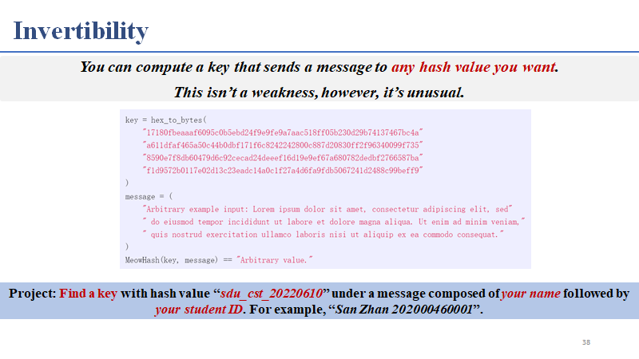
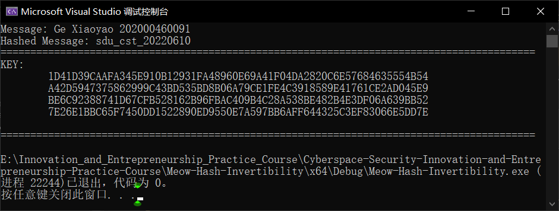

# Meow-Hash-Invertibility

## 题目对应

Find a key with hash value “*sdu_cst_20220610*” under a message composed of *your name* followed by *your student ID*. For example, “*San Zhan 202000460001*”.

## 项目代码说明

对meow_hash_x64_aesni.h中的MeowHash函数进行逆序而诞生了main.cpp中的InvToGetKey函数。

## 运行指导

方法1：点击./Meow-Hash-Invertibility.exe运行；

方法2：在Visual Studio 2022中打开./Meow-Hash-Invertibility.sln，先Ctrl+Shift+B后Ctrl+F5。

## 代码运行全过程截图

## 具体贡献说明及贡献排序

全部代码及对应思路：葛萧遥-202000460091。