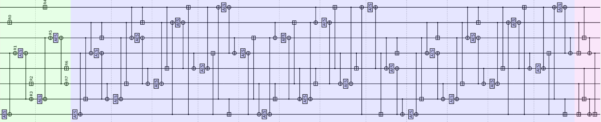
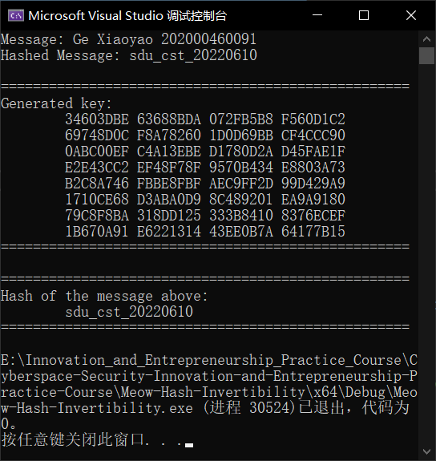

# [Meow Hash: Invertibility](https://github.com/MaxIkaros/Cyberspace-Security-Innovation-and-Entrepreneurship-Practice-Course/tree/main/Meow-Hash-Invertibility)

## 题目对应


Find a key with hash value “*sdu_cst_20220610*” under a message composed of *your name* followed by *your student ID*. For example, “*San Zhan 202000460001*”.

## 项目代码说明

### 总体思路

参照[meow_hash_x64_aesni.h](meow_hash_x64_aesni.h)中的`MeowHash`函数，对Hash过程进行逆序（犹以其中的AES为最）而诞生了main.cpp中的`InvToGetKey`函数。



上图中从左到右为不足32 Bytes的`message`的Hash过程（姓名+学号的内容一般不足32 Bytes），因而`InvToGetKey`函数是从右到左实现上图的过程的。

- 实际上，该代码对<姓氏全拼><空格><名字全拼><空格><12位学号>总体小于32 Bytes的`message`有效。

### 细节注意

对于

```c
#define aesdec(A, B)        A = _mm_aesdec_si128(A, B)
```

的逆向，不是直接`aesenc`

```c
#define aesenc(A, B)	    A = _mm_aesenc_si128(A, B)
```

就可以了的，而是需要`inv_aesdec`

```c
static meow_u128 xmm_allzero = _mm_setzero_si128(); // All zero
#define pxor(A, B)          A = _mm_xor_si128(A, B)
#define inv_mixcol(A)		A = _mm_aesimc_si128(A) // AES-128-ECB invert mix columns
#define MixColumns(A)		A = _mm_aesdeclast_si128(A, xmm_allzero); A = _mm_aesenc_si128(A, xmm_allzero) // AES-128-ECB mix columns

#define inv_aesdec(A, B) \
pxor(A, B);\ /*异或*/
MixColumns(A);\ /*列混合*/
aesenc(A, xmm_allzero);\ /*行移位、S盒置换、列混合（最后的“异或”操作是与全0串进行的，不改变最终结果）*/
inv_mixcol(A) /*逆列混合*/
```

才能保证逆向。因为对于`_mm_aesdec_si128`来说，它是这样运行的：

```c
a[127:0] := InvShiftRows(a[127:0])
a[127:0] := InvSubBytes(a[127:0])
a[127:0] := InvMixColumns(a[127:0])
dst[127:0] := a[127:0] XOR RoundKey[127:0]
```

而`_mm_aesenc_si128`是这样运行的：

```c
a[127:0] := ShiftRows(a[127:0])
a[127:0] := SubBytes(a[127:0])
a[127:0] := MixColumns(a[127:0])
dst[127:0] := a[127:0] XOR RoundKey[127:0]
```

显然`_mm_aesdec_si128`不是直接地逆向运行`_mm_aesenc_si128`的，而是采用“等价解密算法”的方式来实现解密的，在此不作过多讲述。因而我们需要另行实现对`_mm_aesdec_si128`的逆向运行，如`inv_aesdec`所示。

## 运行指导

## 运行指导

方法1：点击[Meow-Hash-Invertibility.exe](Meow-Hash-Invertibility.exe)运行；

方法2：在Visual Studio 2022中打开[Meow-Hash-Invertibility.sln](Meow-Hash-Invertibility.sln)，先Ctrl+Shift+B后Ctrl+F5。

## 代码运行全过程截图



其中：

- `Message`：需要Hash的信息，题目所要求的是“姓名+学号”；
- `Hashed Message`：Hash值，此处固定为`sdu_cst_20220610`；
- `Generated key`：经过程序运行后所得到的key，为16进制的格式（中间空格不是key的一部分）（由于每次填充的内容不同，因而所生成的Generated key不同）；
- `Hash of the message above`：验证所生成的key是否可行。显而易见，可行。

## 具体贡献说明及贡献排序

全部代码及对应思路：[葛萧遥-202000460091](https://github.com/MaxIkaros)。

## 参考资料

1. [Meow hash 0.5/calico](https://github.com/cmuratori/meow_hash)；
2. [Cryptanalysis of Meow Hash](https://peter.website/meow-hash-cryptanalysis)；
3. [Intel AES-NI使用入门](https://www.anquanke.com/post/id/260323)；
4. 2022年6月10日上课时的课件和录屏。
