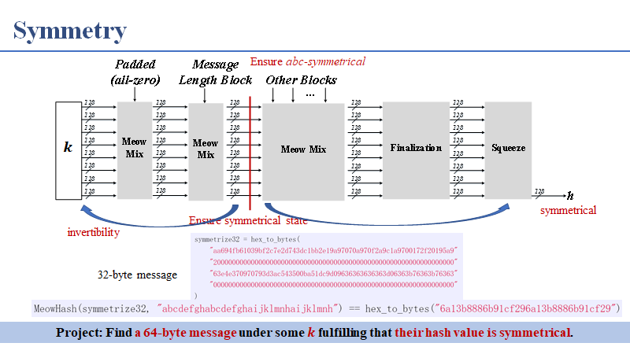
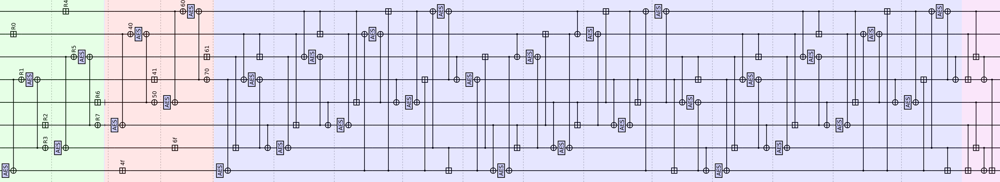
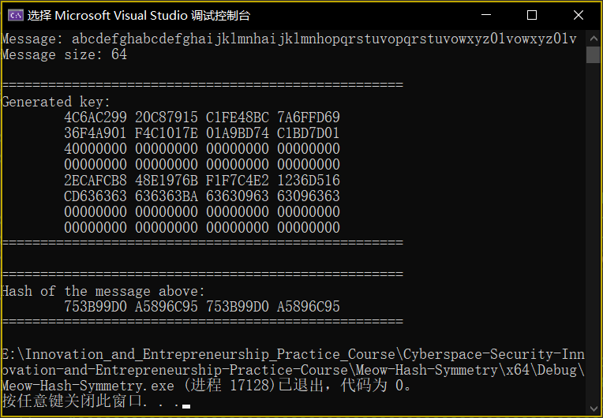
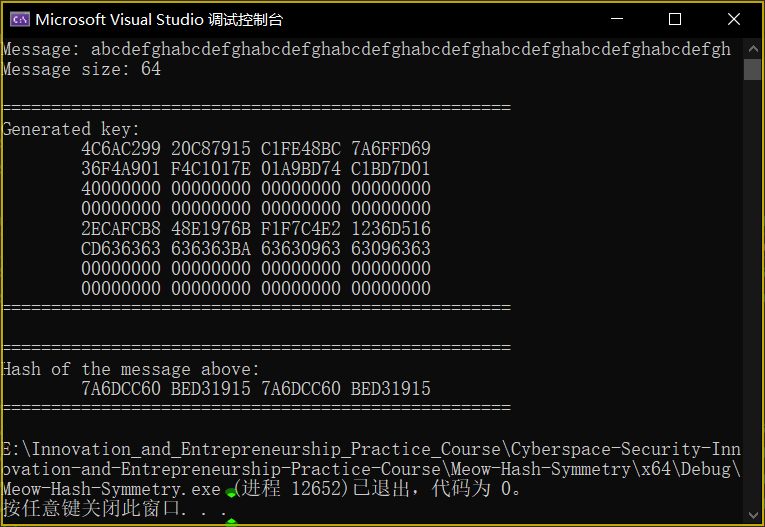
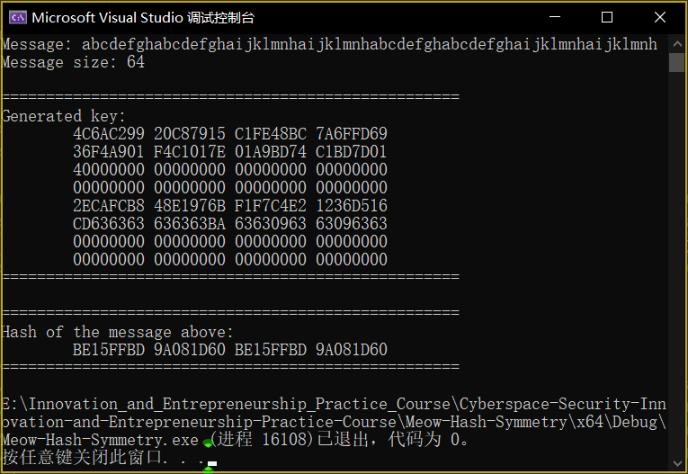

# [Meow Hash: Symmetry](https://github.com/MaxIkaros/Cyberspace-Security-Innovation-and-Entrepreneurship-Practice-Course/tree/main/Meow-Hash-Symmetry)

## 对应题目

Find a 64-byte message under some *k* fulfilling that their hash value is symmetrical.

## 项目代码说明

如上图所示，在已经合并非对称长度字段之后但在合并任何消息字节之前使状态对称（即为全0），然后逆向运行Meow Hash的Absorption function，从而构造出一个全新的密钥，该密钥将在长度被吸收后达到对称状态。同时，`message`要保证是abc-symmetrical的。

上图为64 Bytes的信息的Hash过程。

- 实际上，该代码对长度为32、64、96、128、160、192、224 Bytes的`message`均可运行。

## 运行指导

方法1：点击[Meow-Hash-Symmetry.exe](Meow-Hash-Symmetry.exe)运行；（默认message为`“abcdefghabcdefghaijklmnhaijklmnhopqrstuvopqrstuvowxyz01vowxyz01v”`）

方法2：在Visual Studio 2022中打开[Meow-Hash-Symmetry.sln](Meow-Hash-Symmetry.sln)，先Ctrl+Shift+B后Ctrl+F5。

## 代码运行全过程截图

当message满足`“abcdefghabcdefghaijklmnhaijklmnhopqrstuvopqrstuvowxyz01vowxyz01v”`的格式（其中，以上出现的26个字母和“0”“1”两个数字分别代表28个不同的字符（可以相同））即为“abc-symmetrical message”。

其中：

- `Message`：需要Hash的信息，需要满足abc-symmetrical；
- `Message size`：`Message`的长度（单位为Byte），题目所要求的是64；
- `Generated key`：经过程序运行后所得到的key，为16进制的格式（中间空格不是key的一部分）；
- `Hash of the message above`：`Message`Hash之后的结果，为16进制的格式（中间空格不是key的一部分），显然是对称的。

## 具体贡献说明及贡献排序

全部代码及对应思路：[葛萧遥-202000460091](https://github.com/MaxIkaros)。

## 参考资料

1. [Meow hash 0.5/calico](https://github.com/cmuratori/meow_hash)；
2. [Cryptanalysis of Meow Hash](https://peter.website/meow-hash-cryptanalysis)；
3. [Intel AES-NI使用入门](https://www.anquanke.com/post/id/260323)；
4. 2022年6月10日上课时的课件和录屏。
