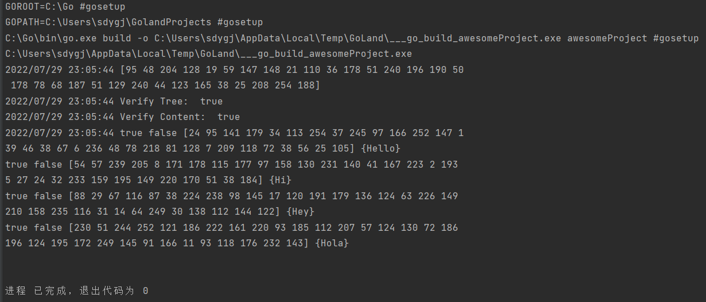

# Merkel Tree

author: cipeizheng(贾晨铮)

## 测试环境

Windows 10，Goland 2022.1.4

## 项目概述

于merkeltree目录下实现默克尔树，其中哈希函数使用SHA256

在main.go中实现默克尔树的简单测试

具体测试内容参照main.go文件内注释

运行指导：直接运行main.go文件即可

## 测试结果

