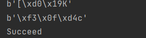

# SM3生日攻击

## 库依赖：

密码算法库：
[snowland-smx · PyPI](https://pypi.org/project/snowland-smx/)

## 算法内容：

假设要碰撞的是n bits长的字符串

1. 生成两个序列，长度为sqrt(n)，每个元素为n bits长字符串。
2. 计算两个序列的哈希值，为两个新序列
3. 求交集

更新：

1. 将序列修改为字典，方便对应哈希值
2. 添加了另一种方法, 不使用两个序列，而是一个序列。

## 结果

## 作者

贾晨铮(cipeizheng)
