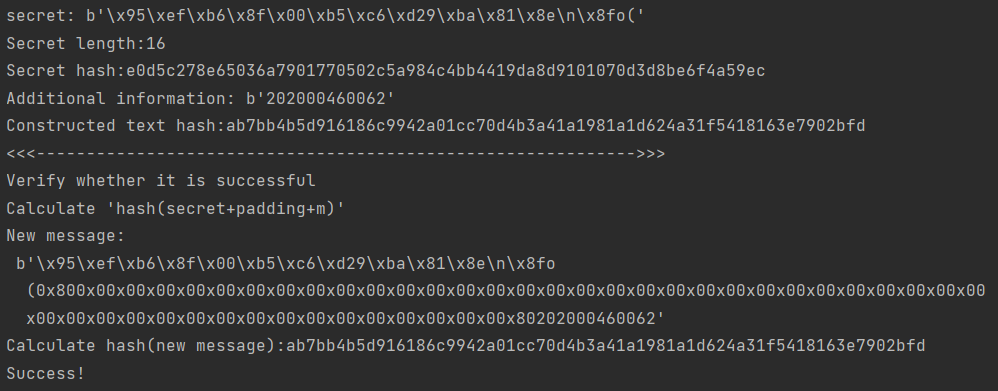

# SM3的长度扩展攻击

author：cipeizheng

## 文件说明

1. main.py 实现攻击

2. sm3_mod 修改了gmssl实现，可以自定义iv

3. func.py 直接拿了gmssl的常用函数

## 依赖 

[gmssl · pypi](https://pypi.org/project/gmssl/)

## 方法简述

1. 随机生成一个比特串secret，用SM3函数算出哈希值

2. 生成一个附加消息m。首先用hash1接着进行哈希运算，算出下一次加密要用的iv的值，加密m，得到另一个哈希值(hash2)

3. 计算secret + padding + m的hash值(hash3)，若攻击成功，则hash2和hash3相等

## 细节概要

1. 使用os中的函数生成随机的比特串

2. 构造消息时用的字符可随意选择

## 结果

