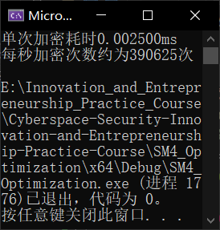

# [SM4_Optimization](https://github.com/MaxIkaros/Cyberspace-Security-Innovation-and-Entrepreneurship-Practice-Course/tree/main/SM4_Optimization)

已优化了的SM4算法。其中，[SM4_Unoptimization](https://github.com/MaxIkaros/Cyberspace-Security-Innovation-and-Entrepreneurship-Practice-Course/tree/main/SM4_Unoptimization)是对照组。

------

## 题目对应

“尝试优化SM4……各种方法……”（群内视频文件*2022_5_14_2.mp4*20:50开始）

## 项目代码说明

这个是已优化了的SM4算法。与[SM4_Unoptimization](https://github.com/MaxIkaros/Cyberspace-Security-Innovation-and-Entrepreneurship-Practice-Course/tree/main/SM4_Unoptimization)相比，其中有5处优化：

1. 将S盒变换中的Sbox局部变量调整为全局常量，从而减少寻址时间；

2. 在用于将四字节的循环左移的函数中，将

	```c++
	((x << h) | (x >> (32 ‐ h))) & 0xFFFFFFFF;
	```

	转换为

	```c++
	return ((x << h) | (x >> (32 ‐ h)));
	```

	让它自然溢出，从而减少一次与`0xFFFFFFFF`的与操作；

3. 在用于密钥生成和函数的T函数中，从原来的

	```c++
	BYTE* a = (BYTE*)&x & 0xff; // 每8位都要&0xff
	```

	改为

	```c++
	BYTE* a = (BYTE*)&x;
	```

	直接利用`x`进行操作，省去了赋值的时间；

4. 通过运用SIMD技术，将四次异或优化成了一次异或和一次存储，从而节省时间；

5. 在S盒置换中，省去变量定义，调整二维数组为一维数组，方便寻址。

> 本代码为2022年上半年的计算机系统原理课程的实验三（国密SM4的软件实现与优化）的实验报告的部分截取。该实验由本*README.md*作者葛萧遥所在的计算机系统原理小组成员共同完成。
> - 该课程小组的全体组员为：**葛萧遥**、**贾晨铮**、姜正宇、黄壮、邵帅鸣。（字体加粗者为本课程的小组成员）

## 运行指导

方法1：点击[SM4_Optimization.exe](SM4_Optimization.exe)运行；

方法2：在Visual Studio 2022中打开[SM4_Optimization.sln](SM4_Optimization.sln)，先Ctrl+Shift+B后Ctrl+F5。

## 代码运行全过程截图



由上图可以看出，优化后的算法相较于未优化的算法在时间上降低了一个数量级，在效率上提升了一个数量级。

## 具体贡献说明及贡献排序

代码思路优化与完成：[葛萧遥](https://github.com/MaxIkaros)、[贾晨铮](https://github.com/cipeizheng)。
