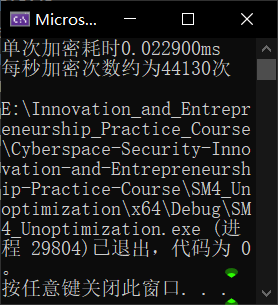

# [SM4_Unoptimization](https://github.com/MaxIkaros/Cyberspace-Security-Innovation-and-Entrepreneurship-Practice-Course/tree/main/SM4_Unoptimization)

未优化的SM4算法，用于作[SM4_Optimization](https://github.com/MaxIkaros/Cyberspace-Security-Innovation-and-Entrepreneurship-Practice-Course/tree/main/SM4_Optimization)的对照组。

------

## 题目对应

“尝试优化SM4……各种方法……”（群内视频文件*2022_5_14_2.mp4*20:50开始）

## 项目代码说明

朴素的SM4算法，用于作[SM4_Optimization](https://github.com/MaxIkaros/Cyberspace-Security-Innovation-and-Entrepreneurship-Practice-Course/tree/main/SM4_Optimization)的对照组。

> 本代码为2022年上半年的计算机系统原理课程的实验三（国密SM4的软件实现与优化）的实验报告的部分截取。该实验由本*README.md*作者葛萧遥所在的计算机系统原理小组成员共同完成。
> - 该课程小组的全体组员为：**葛萧遥**、**贾晨铮**、姜正宇、黄壮、邵帅鸣。（字体加粗者为本课程的小组成员）

### 实验环境

- 软件：Visual Studio 2022 (Community)
- 处理器：Intel(R) Core(TM) i7-10750H CPU @ 2.60GHz   2.59 GHz
- 机带RAM：16.0 GB (15.8 GB 可用)
- 内核：6
- 逻辑处理器：12
- L1缓存：384KB
- L2缓存：1.5MB
- L3缓存：12.0MB

## 运行指导

方法1：点击[SM4_Unoptimization.exe](SM4_Unoptimization.exe)运行；

方法2：在Visual Studio 2022中打开[SM4_Unoptimization.sln](SM4_Unoptimization.sln)，先Ctrl+Shift+B后Ctrl+F5。

## 代码运行全过程截图

## 具体贡献说明及贡献排序

代码思路优化与完成：[葛萧遥](https://github.com/MaxIkaros)、[贾晨铮](https://github.com/cipeizheng)。
